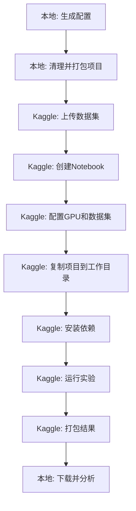

# Kaggle完整部署指南 - MCM超参数搜索

## 📌 核心概念说明

### 1. 项目上传方式

Kaggle无法直接上传Python代码，需要通过**数据集(Dataset)**方式上传。

**两种上传模式**：

| 模式 | 数据集数量 | 优点 | 缺点 | 适用场景 |
|------|-----------|------|------|---------|
| **完整模式** | 1个 | 简单 | 修改代码需重传全部(6GB) | 首次使用/稳定运行 |
| **分离模式** 🌟 | 2个 | 代码更新快(<3分钟) | 设置稍复杂 | 频繁修改代码 |

**推荐**：先用完整模式熟悉流程，确认无误后切换到分离模式以提高效率。

### 2. 目录结构说明

#### 完整模式的目录结构

**上传后的初始结构：**
```
/kaggle/input/mcm-project/    # 你上传的数据集（只读）
  └── MCM/                     # 项目根目录
      ├── data/               # 数据集（会随项目移动）
      │   ├── imgs/
      │   ├── MNER/
      │   ├── MNRE/
      │   └── MASC/
      ├── scripts/
      ├── models/
      ├── datasets/
      └── ...

/kaggle/working/               # 可写目录（会保留）
```

**运行时的目录结构：**
```
/MCM/           # 复制后的项目（可写）
  ├── data/                    # 数据集随项目移动
  ├── scripts/
  ├── models/
  └── ...

/kaggle/working/checkpoints/   # 实验结果输出目录
  ├── train_info_*.json
  └── *.pt
```

#### 分离模式的目录结构

**上传后的初始结构：**
```
/kaggle/input/mcm-code/        # 代码数据集（只读，可频繁更新）
  ├── scripts/
  ├── models/
  ├── datasets/
  ├── continual/
  └── ...代码文件

/kaggle/input/mcm-data/        # 数据数据集（只读，一次性上传）
  ├── data/
  │   ├── twitter2015/
  │   ├── twitter2017/
  │   └── ...
  └── downloaded_model/
      ├── deberta-v3-base/
      └── vit-base-patch16-224-in21k/

/kaggle/working/               # 可写目录
```

**运行时的目录结构：**
```
/MCM/           # 组合后的项目
  ├── scripts/                 # 从mcm-code复制
  ├── models/                  # 从mcm-code复制
  ├── datasets/                # 从mcm-code复制
  ├── data/                    # 链接到mcm-data/data
  └── downloaded_model/        # 链接到mcm-data/downloaded_model

/kaggle/working/checkpoints/   # 实验结果输出
```

### 3. 路径配置策略
- **数据集路径**：使用项目内相对路径（如 `data/twitter2015/`），随项目移动自动正确
- **输出路径**：修改为 `/kaggle/working/checkpoints/`
- **代码导入**：工作目录设为 `/MCM`，添加到 `sys.path`

---

## 🔧 步骤1：前期准备（本地操作）

### 1.1 生成Kaggle配置文件

在项目根目录执行：

```bash
python scripts/generate_kaggle_hyperparameter_configs.py \
    --dataset twitter2015 \
    --kaggle_dataset_name mcm-project \
    --max_experiments_per_session 5
```

这会生成：
- ✅ `scripts/configs/kaggle_hyperparam_search/*.json` - 配置文件
- ✅ `scripts/configs/kaggle_hyperparam_search/kaggle_runner.py` - 运行脚本（自动检测模式）
- ✅ `scripts/configs/kaggle_hyperparam_search/prepare_for_kaggle.sh` - 完整打包
- ✅ `scripts/configs/kaggle_hyperparam_search/prepare_code_only.sh` - 代码打包（分离模式）
- ✅ `scripts/configs/kaggle_hyperparam_search/prepare_data_only.sh` - 数据打包（分离模式）
- ✅ `scripts/configs/kaggle_hyperparam_search/SPLIT_UPLOAD_GUIDE.md` - 分离模式详细指南
- ✅ `scripts/configs/kaggle_hyperparam_search/analyze_kaggle_results.py` - 结果分析

### 1.2 检查必要文件

确保项目包含：

- [x] `requirements.txt` - Python依赖
- [x] `scripts/train_with_zero_shot.py` - 训练脚本
- [x] `data/twitter2015_images/` - 数据集
- [x] `data/MNER/`, `data/MNRE/`, `data/MASC/` - 其他数据
- [x] `downloaded_model/` - 预训练模型（DeBERTa, ViT）
- [x] `models/`, `datasets/`, `continual/` - 代码文件

### 1.3 清理项目并打包

#### 选择模式

**模式A：完整模式**（首次推荐，简单）

```bash
cd /path/to/MCM
bash scripts/configs/kaggle_hyperparam_search/prepare_for_kaggle.sh
```

脚本会：
1. 清理 `__pycache__/` 和 `*.pyc`
2. 询问是否删除 `checkpoints/`、`log/`、`.git/`
3. 生成 `MCM_kaggle.zip`（约2-5GB）

**模式B：分离模式**（频繁修改代码推荐）🌟

```bash
cd /path/to/MCM

# 1. 打包数据（一次性）
bash scripts/configs/kaggle_hyperparam_search/prepare_data_only.sh
# 生成 MCM_data.zip (~2-5GB)

# 2. 打包代码
bash scripts/configs/kaggle_hyperparam_search/prepare_code_only.sh
# 生成 MCM_code.zip (~10-50MB)
```

**后续修改代码**：
```bash
# 只需重新打包代码（<1分钟）
bash scripts/configs/kaggle_hyperparam_search/prepare_code_only.sh
# 在Kaggle更新 mcm-code 数据集版本
```

📖 **详细分离模式说明**：查看 `SPLIT_UPLOAD_GUIDE.md`

---

## 📦 步骤2：上传到Kaggle数据集

### 模式A：完整模式上传

#### 2A.1 创建数据集

1. 访问 [https://www.kaggle.com/datasets](https://www.kaggle.com/datasets)
2. 点击 **"New Dataset"**
3. 上传 `MCM_kaggle.zip`
4. 配置：
   - **Title**: MCM Project
   - **Slug**: `mcm-project` ⚠️ 重要
   - **Visibility**: Private
5. 点击 **"Create"**
6. 等待上传和解压（10-30分钟）

**结果**：`/kaggle/input/mcm-project/`

---

### 模式B：分离模式上传 🌟

#### 2B.1 上传数据数据集（一次性）

1. 访问 [https://www.kaggle.com/datasets](https://www.kaggle.com/datasets)
2. 点击 **"New Dataset"**
3. 上传 `MCM_data.zip`
4. 配置：
   - **Title**: MCM Data
   - **Slug**: `mcm-data` ⚠️ 必须是这个名称
   - **Visibility**: Private
5. 点击 **"Create"**
6. 等待上传（10-30分钟，只需一次）

**结果**：`/kaggle/input/mcm-data/`

#### 2B.2 上传代码数据集

1. 再次访问 [https://www.kaggle.com/datasets](https://www.kaggle.com/datasets)
2. 点击 **"New Dataset"**
3. 上传 `MCM_code.zip`
4. 配置：
   - **Title**: MCM Code
   - **Slug**: `mcm-code` ⚠️ 必须是这个名称
   - **Visibility**: Private
5. 点击 **"Create"**
6. 等待上传（1-5分钟）

**结果**：`/kaggle/input/mcm-code/`

#### 2B.3 修改代码后更新（常用）

1. 找到你的 `mcm-code` 数据集
2. 点击 **"New Version"**（新版本）
3. 上传新的 `MCM_code.zip`
4. 写版本说明：`v2: 修复bug XXX`
5. 点击 **"Create"**
6. 等待更新（1-3分钟）⚡ 超快！

📖 **详细说明**：`SPLIT_UPLOAD_GUIDE.md`

---

## 📓 步骤3：创建Kaggle Notebook

### 3.1 新建Notebook

1. 访问 [https://www.kaggle.com/code](https://www.kaggle.com/code)
2. 点击 **"New Notebook"**
3. 选择 **Python**
4. 设置标题：`MCM Hyperparameter Search - Batch 1`

### 3.2 配置Notebook

点击右侧 **Settings** 面板：

**⚙️ Accelerator（加速器）**
- 选择 **GPU P100** （推荐，16GB显存）
- 或 **GPU T4**（如果P100不可用，8GB显存）
- ⚠️ **不要选择TPU**

**⚙️ Internet（网络）**
- 开启（如果需要下载依赖）

**⚙️ Environment（环境）**
- 保持默认即可

**📁 Data（数据）**

**完整模式**：
1. 点击 **"+ Add Data"**
2. 选择 **"Your Datasets"**
3. 搜索 `mcm-project`
4. 点击 **"Add"**

**分离模式**：
1. 点击 **"+ Add Data"**
2. 添加 `mcm-code` ✅
3. 再次点击 **"+ Add Data"**
4. 添加 `mcm-data` ✅
5. 确认两个数据集都已添加

### 3.3 编写Notebook代码

#### Cell 1: 环境检查（自动检测模式）

```python
import os
import sys
import shutil
from pathlib import Path

print("="*80)
print("环境检查")
print("="*80)

# 检查Kaggle环境
print("\n可用数据集:")
for dataset in os.listdir("/kaggle/input"):
    print(f"  - {dataset}")

# 自动检测模式
use_split_mode = False
code_path = None
data_path = None

# 检测分离模式
if os.path.exists("/kaggle/input/mcm-code"):
    use_split_mode = True
    code_path = Path("/kaggle/input/mcm-code")
    print("\n✓ 检测到分离模式")
    print(f"  代码路径: {code_path}")
    
    if os.path.exists("/kaggle/input/mcm-data"):
        data_path = Path("/kaggle/input/mcm-data")
        print(f"  数据路径: {data_path}")
    else:
        print("  ⚠️ 未找到 mcm-data，请在Data面板添加")

# 检测完整模式
else:
    possible_paths = [
        Path("/kaggle/input/mcm-project/MCM"),
        Path("/kaggle/input/mcm-project"),
    ]
    
    for path in possible_paths:
        if path.exists():
            code_path = path
            print(f"\n✓ 检测到完整模式")
            print(f"  项目路径: {path}")
            break

if code_path is None:
    raise FileNotFoundError("未找到项目！请检查数据集配置")

# 列出项目内容
print("\n项目内容（前10项）:")
items = list(code_path.iterdir())[:10]
for item in items:
    print(f"  - {item.name}")
```

#### Cell 2: 复制项目到工作目录（支持两种模式）

```python
# 复制项目到可写目录
work_project_path = Path("/MCM")

if not work_project_path.exists():
    print("复制代码到工作目录...")
    print(f"  源: {code_path}")
    print(f"  目标: {work_project_path}")
    shutil.copytree(code_path, work_project_path, dirs_exist_ok=True)
    print("✓ 复制完成")
else:
    print("⚠️ 工作目录已存在，跳过复制")

# 如果是分离模式，链接数据目录
if use_split_mode and data_path:
    target_data = work_project_path / "data"
    target_model = work_project_path / "downloaded_model"
    
    # 链接data
    if not target_data.exists():
        source_data = data_path / "data" if (data_path / "data").exists() else data_path
        print(f"\n链接数据目录: {source_data} -> {target_data}")
        try:
            os.symlink(source_data, target_data)
            print("✓ data链接成功")
        except:
            print("  符号链接失败，改用复制...")
            shutil.copytree(source_data, target_data, dirs_exist_ok=True)
            print("✓ data复制完成")
    
    # 链接模型
    source_model = data_path / "downloaded_model"
    if source_model.exists() and not target_model.exists():
        print(f"\n链接模型目录: {source_model} -> {target_model}")
        try:
            os.symlink(source_model, target_model)
            print("✓ downloaded_model链接成功")
        except:
            shutil.copytree(source_model, target_model, dirs_exist_ok=True)
            print("✓ downloaded_model复制完成")

# 切换工作目录
os.chdir(work_project_path)
sys.path.insert(0, str(work_project_path))

print(f"\n当前工作目录: {os.getcwd()}")
print(f"Python路径: {sys.path[0]}")

# 验证数据集
data_dir = work_project_path / "data"
print(f"\n数据目录: {data_dir}")
print(f"数据集存在: {data_dir.exists()}")

if data_dir.exists():
    print("\n可用数据集:")
    for item in data_dir.iterdir():
        if item.is_dir():
            print(f"  - {item.name}/")
```

#### Cell 3: 安装依赖

```python
# Kaggle优化的依赖安装
# Kaggle已预装大多数包，只需安装项目特定的包

import subprocess
import sys

print("="*80)
print("安装依赖")
print("="*80)

# 检查Kaggle优化的requirements文件
kaggle_req = work_project_path / "requirements_kaggle.txt"
regular_req = work_project_path / "requirements.txt"

if kaggle_req.exists():
    print("\n✓ 使用Kaggle优化的依赖文件")
    print("  只安装必需的特定版本包，避免版本冲突...")
    !pip install -q -r {str(kaggle_req)}
    print("✓ 依赖安装完成")
    
elif regular_req.exists():
    print("\n⚠️  使用标准依赖文件（可能有版本冲突警告）")
    print("  Kaggle预装包版本可能与requirements.txt不同...")
    print("  版本冲突警告通常可以忽略\n")
    !pip install -q -r {str(regular_req)}
    print("\n✓ 依赖安装完成（请忽略版本冲突警告）")
    
else:
    print("\n未找到依赖文件，安装最小依赖集...")
    !pip install -q pytorch_crf sentencepiece protobuf==3.20.3
    print("✓ 最小依赖安装完成")

print("\n说明:")
print("  • Kaggle已预装: torch, transformers, numpy, scikit-learn等")
print("  • 版本冲突警告可以安全忽略")
print("  • 项目会使用Kaggle预装的包版本")
```

#### Cell 4: 检查GPU

```python
import torch

print("="*80)
print("GPU信息")
print("="*80)

if torch.cuda.is_available():
    gpu_name = torch.cuda.get_device_name(0)
    gpu_memory = torch.cuda.get_device_properties(0).total_memory / 1e9
    gpu_available_memory = torch.cuda.get_device_properties(0).total_memory / 1e9
    
    print(f"\\n✓ GPU: {gpu_name}")
    print(f"  总显存: {gpu_memory:.1f} GB")
    print(f"  CUDA版本: {torch.version.cuda}")
    print(f"  PyTorch版本: {torch.__version__}")
    print(f"\\n  GPU状态: 可用")
else:
    print("\\n❌ 未检测到GPU")
    print("\\n请检查Notebook设置 → Accelerator → 选择 GPU P100 或 T4")
```

#### Cell 5: 配置实验参数

```python
# ⚠️ 根据Kaggle时间限制调整实验范围
START_EXP = 1       # 起始实验ID
END_EXP = 5         # 结束实验ID（建议3-5个）

print("="*80)
print("实验配置")
print("="*80)
print(f"\\n起始实验: {START_EXP}")
print(f"结束实验: {END_EXP}")
print(f"总实验数: {END_EXP - START_EXP + 1}")
print(f"\\n预计时间: {(END_EXP - START_EXP + 1) * 1.5:.1f} - {(END_EXP - START_EXP + 1) * 2:.1f} 小时")
print(f"\\n⏰ Kaggle时间限制: 9-12小时")

if (END_EXP - START_EXP + 1) * 2 > 9:
    print("\\n⚠️ 警告：预计时间可能超过Kaggle限制，建议减少实验数量")
```

#### Cell 6: 运行实验

```python
# 方法1: 使用kaggle_runner.py脚本（推荐）

runner_script = work_project_path / "scripts/configs/kaggle_hyperparam_search/kaggle_runner.py"

if runner_script.exists():
    print("="*80)
    print(f"运行实验 #{START_EXP} 到 #{END_EXP}")
    print("="*80)
    print()
    
    # 运行脚本
    !python {str(runner_script)} --start_exp {START_EXP} --end_exp {END_EXP}
    
else:
    print(f"❌ 运行脚本不存在: {runner_script}")
    print("\\n请检查配置文件是否正确上传")
```

#### Cell 7: 检查结果

```python
from pathlib import Path

# 检查输出目录
output_dir = Path("/kaggle/working/checkpoints")

if output_dir.exists():
    print("="*80)
    print("实验结果")
    print("="*80)
    
    # 统计文件
    train_info_files = list(output_dir.glob("**/train_info_*.json"))
    model_files = list(output_dir.glob("**/*.pt"))
    
    print(f"\\ntrain_info文件: {len(train_info_files)} 个")
    print(f"模型文件: {len(model_files)} 个")
    
    # 显示文件列表
    if train_info_files:
        print("\\ntrain_info文件:")
        for f in train_info_files:
            size = f.stat().st_size / 1024
            print(f"  - {f.name} ({size:.1f} KB)")
    
    # 计算总大小
    total_size = sum(f.stat().st_size for f in output_dir.rglob("*") if f.is_file()) / (1024 * 1024)
    print(f"\\n总大小: {total_size:.1f} MB")
    
else:
    print("❌ 输出目录不存在，可能实验未成功运行")
```

#### Cell 8: 打包结果

```python
import shutil

# 打包结果
output_zip = Path("/kaggle/working/results.zip")

if output_dir.exists():
    print("打包实验结果...")
    
    # 创建压缩包
    shutil.make_archive(
        str(output_zip.with_suffix('')),
        'zip',
        output_dir
    )
    
    zip_size = output_zip.stat().st_size / (1024 * 1024)
    print(f"\\n✓ 结果已打包: {output_zip}")
    print(f"  大小: {zip_size:.1f} MB")
    print(f"\\n在右侧 'Output' 标签页可以下载此文件")
    
else:
    print("❌ 无结果可打包")
```

---

## 🚀 步骤4：运行实验

### 4.1 运行方式

**方式1：运行全部Cell（推荐）**
1. 点击顶部 **"Run All"** 按钮
2. 等待所有Cell执行完成

**方式2：逐个运行**
1. 依次点击每个Cell左侧的运行按钮
2. 等待每个Cell完成后再运行下一个

### 4.2 监控进度

- **实时日志**：观察Cell 6的输出
- **进度文件**：查看 `/kaggle/working/experiment_progress.json`
- **GPU使用**：Kaggle界面右侧会显示GPU使用率

### 4.3 时间估算

| GPU类型 | 每个实验耗时 | 建议实验数 | 总耗时 |
|---------|------------|-----------|--------|
| P100    | 1.5-2小时   | 3-5个     | 4.5-10小时 |
| T4      | 2-2.5小时   | 2-3个     | 4-7.5小时 |

### 4.4 分批运行策略

由于Kaggle有9-12小时限制，建议分批运行：

**Batch 1**（实验1-5）:
```python
START_EXP = 1
END_EXP = 5
```

**Batch 2**（实验6-10）:
```python
START_EXP = 6
END_EXP = 10
```

每批完成后：
1. 下载 `results.zip`
2. 创建新的Notebook
3. 继续下一批

---

## 💾 步骤5：下载结果

### 5.1 从Notebook下载

1. 确保Cell 8已执行（打包结果）
2. 点击右侧 **"Output"** 标签页
3. 找到 `results.zip`
4. 点击右侧下载图标

### 5.2 验证结果

解压 `results.zip` 后，应该包含：

```
checkpoints/
  ├── train_info_twitter2015_none_t2m_hp1.json
  ├── train_info_twitter2015_none_t2m_hp2.json
  ├── ...
  ├── twitter2015_mate_none_multimodal_hp1.pt
  ├── twitter2015_mate_none_text_only_hp1.pt
  └── ...
```

### 5.3 本地分析

```bash
# 解压
unzip results.zip -d ./kaggle_results

# 运行分析脚本
python scripts/configs/kaggle_hyperparam_search/analyze_kaggle_results.py \
    --results_dir ./kaggle_results \
    --output_dir ./kaggle_analysis
```

---

## ⚠️ 常见问题与解决

### 问题1：依赖冲突警告

**现象**：
```
ERROR: pip's dependency resolver does not currently take into account all the packages...
datasets 4.1.1 requires pyarrow>=21.0.0, but you have pyarrow 19.0.1
transformers需要>=4.41.0，但安装的是4.30.2
...等大量WARNING
```

**原因**：
- Kaggle预装了特定版本的包
- 项目requirements.txt指定了不同版本
- pip检测到版本不匹配

**✅ 解决方案**：

**方案1：使用Kaggle优化的requirements（推荐）**

在项目根目录创建 `requirements_kaggle.txt`:
```txt
# 只安装Kaggle没有或需要特定版本的包
pytorch_crf==0.7.2
sentencepiece==0.1.99
protobuf==3.20.3
openpyxl>=3.0.0
```

然后在Notebook中：
```python
!pip install -q -r requirements_kaggle.txt
```

**方案2：忽略版本冲突（简单有效）**

这些WARNING通常**可以安全忽略**，因为：
- Kaggle预装的包版本通常更新且兼容
- 项目代码通常不依赖特定的次版本号
- 只要主版本号兼容，就能正常运行

在Notebook中：
```python
# 忽略版本冲突，继续安装
!pip install -q -r requirements.txt 2>&1 | grep -v "ERROR:" || true
```

**方案3：验证关键包**

安装后验证关键功能：
```python
# 验证关键包
import torch
import transformers
import pytorch_crf
import sentencepiece

print(f"✓ torch: {torch.__version__}")
print(f"✓ transformers: {transformers.__version__}")
print(f"✓ pytorch_crf可用")
print(f"✓ sentencepiece可用")
```

只要这些包能正常导入，就可以继续运行。

**重要提示**：
- ⚠️ 版本冲突**警告**不等于安装**失败**
- ✅ 大多数情况下Kaggle预装版本更好
- ✅ 项目代码通常向后兼容
- ⚠️ 只有运行时报错才需要处理

### 问题2：找不到项目

**现象**：
```
FileNotFoundError: 未找到MCM项目
```

**原因**：
- 数据集名称不正确
- 数据集未添加到Notebook

**解决**：
1. 检查数据集slug：`/kaggle/input/<这里>/`
2. 在Notebook设置中添加数据集
3. 修改Cell 1中的 `dataset_name`

### 问题2：ModuleNotFoundError

**现象**：
```
ModuleNotFoundError: No module named 'scripts'
```

**原因**：
- 工作目录不正确
- Python路径未设置

**解决**：
```python
import os, sys
os.chdir("/kaggle/working/MCM")
sys.path.insert(0, "/kaggle/working/MCM")
```

### 问题3：CUDA out of memory

**现象**：
```
RuntimeError: CUDA out of memory
```

**原因**：
- GPU显存不足
- batch_size过大

**解决**：
1. 在配置文件中减小 `batch_size`
2. 或在训练前清空缓存：
```python
import torch
torch.cuda.empty_cache()
```

### 问题4：数据集路径错误

**现象**：
```
FileNotFoundError: data/twitter2015_images/
```

**原因**：
- 数据集未随项目移动
- 工作目录不正确

**解决**：
1. 确保执行了Cell 2（复制项目）
2. 确认当前工作目录：
```python
print(os.getcwd())  # 应该是 /kaggle/working/MCM
```

### 问题5：运行超时

**现象**：Kaggle在9小时后自动终止

**解决**：
- 减少每批实验数量（3-5个）
- 使用 `--start_exp` 和 `--end_exp` 分批运行

### 问题6：无法保存结果

**现象**：
```
PermissionError: /kaggle/input/ is read-only
```

**原因**：尝试写入只读目录

**解决**：
确保配置文件中的输出路径是 `/kaggle/working/checkpoints/`

### 问题7：分离模式 - 只添加了一个数据集

**现象**：
```
未找到 mcm-data 数据集
或
FileNotFoundError: data/twitter2015_images/
```

**原因**：使用分离模式但只添加了 `mcm-code`，忘记添加 `mcm-data`

**解决**：
1. 在Notebook右侧 **Data** 面板
2. 点击 **"+ Add Data"**
3. 添加 `mcm-data` 数据集
4. 重新运行 Cell 1 和 Cell 2

### 问题8：分离模式 - 代码更新后还是旧版本

**现象**：修改代码并更新数据集后，Notebook运行的还是旧代码

**解决**：
1. 检查 `mcm-code` 数据集是否更新成功
2. 在Notebook的Data面板，确认使用的是最新版本
3. 重启Kernel（Kernel → Restart）
4. 清除工作目录：
```python
import shutil
shutil.rmtree("/kaggle/working/MCM", ignore_errors=True)
```
然后重新运行所有Cell

### 问题9：分离模式 - 数据集名称错误

**现象**：
```
未检测到分离模式
```

**原因**：数据集slug名称不正确

**解决**：
确保数据集slug必须是：
- `mcm-code` （不是 mcm_code、MCM-Code 等）
- `mcm-data` （不是 mcm_data、MCM-Data 等）

在Kaggle数据集设置中检查并修改slug

### 问题10：文件保存位置错误（显示保存但实际为空）

**现象**：
```
实验运行正常，日志显示保存成功
但检查 /kaggle/working/checkpoints/ 时文件数为0
打包结果时也是空文件
```

**原因**：
配置文件中的路径没有正确更新到 Kaggle 输出目录，文件被保存到了项目目录 `/MCM/checkpoints/` 而不是 `/kaggle/working/checkpoints/`

**✅ 解决方案（已自动修复）**：

最新版 `kaggle_runner.py` 已经修复此问题，会自动：

1. **更新所有输出路径**：
   - `train_info_json` → `/kaggle/working/checkpoints/...`
   - `output_model_path` → `/kaggle/working/checkpoints/...`
   - `ewc_dir` → `/kaggle/working/checkpoints/...`
   - `label_embedding_path` → `/kaggle/working/checkpoints/...`

2. **实验后验证文件**：
   ```
   ✓ 实验 #1 完成 (耗时: 1.5 小时)
     已保存 15 个文件到 /kaggle/working/checkpoints
     最近生成的文件:
       - train_info_mate_hp1.json (125.32 KB)
       - twitter2015_mate_none_multimodal_hp1.pt (890.45 MB)
       ...
   ```

3. **打包前详细检查**：
   ```
   检查输出目录: /kaggle/working/checkpoints
   ✓ 输出目录存在，共 45 个文件
   文件列表:
     - train_info_mate_hp1.json (125.32 KB)
     - train_info_mner_hp1.json (118.76 KB)
     ...
   ```

**如果仍然出现问题**：

检查配置文件路径更新日志：
```
[INFO] 正在更新配置文件路径...
[INFO]   更新路径: train_info_json
[INFO]     从: checkpoints/train_info_mate_hp1.json
[INFO]     到: /kaggle/working/checkpoints/train_info_mate_hp1.json
[INFO]   更新路径: output_model_path
[INFO]     从: checkpoints/twitter2015_mate_none_multimodal_hp1.pt
[INFO]     到: /kaggle/working/checkpoints/twitter2015_mate_none_multimodal_hp1.pt
```

如果看到警告：
```
⚠️  输出目录不存在: /kaggle/working/checkpoints
发现文件被保存到了项目目录: /MCM/checkpoints
❌ 路径配置有问题！
```

则需要：
1. 检查 `kaggle_runner.py` 是否是最新版本
2. 重新生成配置文件：
   ```bash
   python scripts/generate_kaggle_hyperparameter_configs.py
   ```
3. 重新打包并上传代码

### 问题11：如何节省GPU配额

**问题**：实验完成后忘记停止Session，浪费了GPU配额

**解决方案**：

1. **自动打包功能**（已内置）：
   - 脚本会在完成后自动打包结果
   - 生成 `/kaggle/working/experiment_results.zip`
   - 显示文件大小和下载提示

2. **及时停止Session**：
   ```
   实验完成后会显示提示：
   🎉 所有任务已完成！
   ⚠️ 请立即点击右上角 'Stop Session' 停止Notebook
   ```

3. **分批运行策略**：
   - 每批运行3-5个实验
   - 完成后立即下载结果并停止
   - 创建新Notebook继续下一批
   - 这样即使中断也不会损失所有进度

4. **监控配额**：
   - 在 Kaggle 个人页面查看剩余GPU时间
   - P100约30小时/周，T4约36小时/周
   - 合理安排实验批次

**最佳实践**：
```python
# 在Notebook中设置提醒
import time
start_time = time.time()

# 运行实验...

elapsed_hours = (time.time() - start_time) / 3600
print(f"⏱️ 已使用GPU时间: {elapsed_hours:.2f} 小时")
```

---

## 📊 预期输出

### 成功运行后的输出

#### 1. 实验运行日志

每个实验开始时会显示：
```
================================================================================
运行实验 #1
================================================================================
  任务: mate
  策略: none
  超参数: lr=0.0001, step_size=5, gamma=0.5
  配置文件: /MCM/scripts/configs/kaggle_hyperparam_search/mate_none_hp1.json
================================================================================

[INFO] 正在更新配置文件路径...
[INFO]   更新路径: train_info_json
[INFO]     从: checkpoints/train_info_mate_hp1.json
[INFO]     到: /kaggle/working/checkpoints/train_info_mate_hp1.json
[INFO]   更新路径: output_model_path
[INFO]     从: checkpoints/twitter2015_mate_none_multimodal_hp1.pt
[INFO]     到: /kaggle/working/checkpoints/twitter2015_mate_none_multimodal_hp1.pt
```

实验完成时会显示：
```
[INFO] ✓ 实验 #1 完成 (耗时: 1.5 小时)
[INFO]   已保存 15 个文件到 /kaggle/working/checkpoints
[INFO]   最近生成的文件:
[INFO]     - train_info_mate_hp1.json (125.32 KB)
[INFO]     - twitter2015_mate_none_multimodal_hp1.pt (890.45 MB)
[INFO]     - twitter2015_mate_none_text_only_hp1.pt (720.18 MB)
```

#### 2. 生成的文件

每个实验会生成：

**训练信息文件** `train_info_*.json`:
```json
{
  "accuracy_matrix": [[0.85, 0.0], [0.82, 0.87]],
  "task_info": [...],
  "final_metrics": {
    "AA": 0.845,
    "FM": 0.03,
    ...
  }
}
```

**模型文件** `*.pt`:
- `twitter2015_<task>_none_text_only_hp<N>.pt`
- `twitter2015_<task>_none_multimodal_hp<N>.pt`

**进度文件** `experiment_progress.json`:
```json
{
  "completed_experiments": [1, 2, 3],
  "total_completed": 3,
  "timestamp": "2025-10-27 12:34:56"
}
```

#### 3. 打包前的检查

所有实验完成后，打包前会显示：
```
================================================================================
[INFO] 正在检查并打包实验结果...
================================================================================

[INFO] 检查输出目录: /kaggle/working/checkpoints
[INFO] ✓ 输出目录存在，共 45 个文件

[INFO] 文件列表:
[INFO]   - train_info_mate_hp1.json (125.32 KB)
[INFO]   - train_info_mate_hp2.json (128.45 KB)
[INFO]   - twitter2015_mate_none_multimodal_hp1.pt (890.45 MB)
[INFO]   - twitter2015_mate_none_text_only_hp1.pt (720.18 MB)
[INFO]   ... 还有 41 个文件

[INFO] 开始打包...
[INFO] ✓ 结果已打包: /kaggle/working/experiment_results.zip
[INFO]   文件大小: 2345.6 MB
[INFO]   请在右侧 'Output' 标签页下载 experiment_results.zip
```

#### 4. 异常情况检测

如果文件保存位置错误，会显示：
```
[ERROR] 输出目录不存在: /kaggle/working/checkpoints
[INFO] 尝试检查其他可能的位置...
[WARNING] 发现文件被保存到了项目目录: /MCM/checkpoints
[WARNING]   共 45 个文件
[INFO]   文件列表:
[INFO]     - train_info_mate_hp1.json
[INFO]     - ...
[ERROR] ❌ 路径配置有问题！文件应该保存到 /kaggle/working/checkpoints
[ERROR]    但实际保存到了 /MCM/checkpoints
```

**看到此错误时**：说明路径配置有问题，需要重新生成并上传 `kaggle_runner.py`

---

## 💾 自动打包与节省GPU配额

### 自动打包功能

脚本执行完毕后会**自动打包所有结果**：

1. **自动执行**：无需手动操作
2. **打包位置**：`/kaggle/working/experiment_results.zip`
3. **包含内容**：`/kaggle/working/checkpoints/` 下的所有文件
4. **文件信息**：显示打包后的文件大小

### 节省GPU配额的重要步骤 ⚠️

实验完成后，脚本会显示以下提示：

```
🎉 所有任务已完成！
📦 结果已打包，请下载 experiment_results.zip

⚠️  为节省GPU配额，请立即执行以下操作：
   1. 在右侧 'Output' 标签下载 experiment_results.zip
   2. 点击右上角 'Stop Session' 按钮停止Notebook
   3. 或者等待此脚本自动退出后手动停止
```

### 下载结果

**方法1：从 Output 面板下载**
1. 点击右侧 **Output** 标签
2. 找到 `experiment_results.zip`
3. 点击下载按钮

**方法2：使用代码下载**
```python
from IPython.display import FileLink
FileLink('/kaggle/working/experiment_results.zip')
```

### 停止Session步骤

**一定要及时停止Session！** 否则会持续消耗GPU配额（即使脚本已完成）

1. 确认结果已下载
2. 点击右上角 **Stop Session** 按钮
3. 或者直接关闭Notebook页面（会自动停止）

**节省配额小贴士**：
- Kaggle免费GPU配额：P100约30小时/周
- 及时停止可以最大化利用配额
- 可以分批运行实验，每批完成后立即停止

---

## 🎯 完整工作流程总结



### 时间估算

| 步骤 | 耗时 |
|------|------|
| 准备和打包 | 10-20分钟 |
| 上传数据集 | 15-30分钟 |
| 创建Notebook | 5分钟 |
| 复制项目 | 2-5分钟 |
| 安装依赖 | 2-5分钟 |
| 运行3-5个实验 | 4.5-10小时 |
| 打包下载 | 5-10分钟 |
| **总计** | **约5-11小时** |

---

## 📝 检查清单

### 完整模式检查清单

#### 上传前
- [ ] 生成了Kaggle配置文件
- [ ] 确认数据集齐全（twitter2015/2017, MNER, MNRE, MASC）
- [ ] 包含预训练模型（DeBERTa, ViT）
- [ ] 运行了 `prepare_for_kaggle.sh`
- [ ] 生成了 `MCM_kaggle.zip`

#### Kaggle配置
- [ ] 选择了GPU P100或T4
- [ ] 添加了 `mcm-project` 数据集
- [ ] 开启了Internet（如需要）

---

### 分离模式检查清单 🌟

#### 首次上传
- [ ] 生成了Kaggle配置文件
- [ ] 运行了 `prepare_data_only.sh`
- [ ] 生成了 `MCM_data.zip`
- [ ] 运行了 `prepare_code_only.sh`
- [ ] 生成了 `MCM_code.zip`
- [ ] 上传了 `mcm-data` 数据集
- [ ] 上传了 `mcm-code` 数据集

#### Kaggle配置
- [ ] 选择了GPU P100或T4
- [ ] 添加了 `mcm-code` 数据集 ✅
- [ ] 添加了 `mcm-data` 数据集 ✅
- [ ] 开启了Internet（如需要）

#### 修改代码后（常用）
- [ ] 运行了 `prepare_code_only.sh`
- [ ] 在Kaggle更新了 `mcm-code` 版本（New Version）
- [ ] 在Notebook中选择了最新版本

---

### 通用检查清单

#### Notebook运行
- [ ] Cell 1: 检测到正确模式（分离/完整）
- [ ] Cell 2: 复制/链接成功
- [ ] Cell 3: 依赖安装完成
- [ ] Cell 4: 确认GPU可用
- [ ] Cell 5: 设置实验范围
- [ ] Cell 6: 运行实验
- [ ] Cell 7: 检查结果
- [ ] Cell 8: 打包结果

#### 下载后
- [ ] 解压results.zip
- [ ] 验证文件完整性
- [ ] 运行分析脚本

---

## 🆘 获取帮助

如遇到问题：

1. 检查Notebook输出日志
2. 查看 `/kaggle/working/experiment_progress.json`
3. 确认GPU可用
4. 检查数据集路径
5. 参考上面的"常见问题与解决"
6. **分离模式问题**：查看 `SPLIT_UPLOAD_GUIDE.md`
7. **依赖问题**：查看 `DEPENDENCIES.md`

---

## 📋 快速模式选择指南

### 你应该选择哪种模式？

```
START
  ↓
  ├─ 首次使用Kaggle? → YES → 完整模式（简单熟悉流程）
  │                      ↓
  │                    运行成功? → YES → 切换到分离模式
  │                      ↓
  │                     NO → 查看FAQ
  │
  └─ 经常修改代码? → YES → 分离模式（快速迭代）
                      ↓
                     NO → 完整模式（简单够用）
```

### 模式效率对比

| 场景 | 完整模式耗时 | 分离模式耗时 | 节省 |
|------|------------|------------|------|
| **首次上传** | 20分钟 | 25分钟（数据+代码）| -5分钟 |
| **修改代码1次** | 20分钟 | 3分钟 | **17分钟** ⚡ |
| **修改代码5次** | 100分钟 | 15分钟 | **85分钟** ⚡⚡ |
| **修改代码10次** | 200分钟 | 30分钟 | **170分钟** ⚡⚡⚡ |

**结论**：修改超过2次，分离模式就更高效！

### 推荐学习路径

```
第1天: 完整模式
  → 熟悉Kaggle环境
  → 验证项目可运行
  → 完成1-2次实验

第2天: 切换分离模式
  → 打包并上传 mcm-data（一次性）
  → 打包并上传 mcm-code
  → 验证分离模式正常工作

第3天+: 享受高效迭代
  → 本地修改代码
  → 1分钟打包代码
  → 3分钟更新Kaggle
  → 立即运行新代码
```

---

## 🎓 相关文档

- 📖 **分离上传详细指南**: `SPLIT_UPLOAD_GUIDE.md`
- 📦 **依赖冲突详解**: `DEPENDENCIES.md`
- ⚡ **5分钟快速开始**: `QUICK_START.md`
- 📊 **方案总结**: `SUMMARY.md` 或 `README.md`

所有文档位于：`scripts/configs/kaggle_hyperparam_search/`

---

Good luck with your experiments! 🚀

